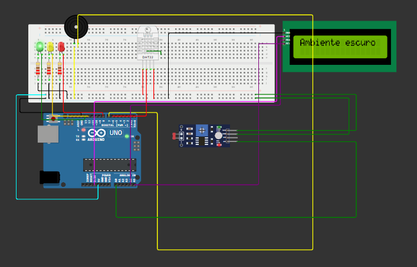

# 🍷 Projeto CP02: Sistema de Monitoramento Ambiental - Vinheria Agnello

## 📌 Visão Geral

Este projeto é a segunda fase da solução de Edge Computing desenvolvida para a Vinheria Agnello. Nesta etapa, o foco está na **monitorização precisa das condições ambientais** — luminosidade, temperatura e umidade — para garantir o armazenamento ideal dos vinhos. O sistema realiza leituras periódicas, interpreta os dados e sinaliza riscos com LEDs e alarme sonoro, conforme especificado pelos proprietários da vinheria.

---

## ⚙️ Componentes Utilizados

- Arduino UNO
- Sensor **DHT22** (Temperatura e Umidade)
- Sensor **LDR** (Luminosidade)
- Display LCD 16x2 com comunicação I2C
- 3 LEDs (Verde, Amarelo, Vermelho)
- Buzzer Ativo
- Resistores de 220Ω
- Protoboard e jumpers

---

## 🔌 Mapeamento de Conexões

| Componente       | Pino Arduino |
|------------------|--------------|
| **DHT22 (DATA)** | 6            |
| **LDR (AO)**     | A0           |
| **LED Verde**    | 13           |
| **LED Amarelo**  | 12           |
| **LED Vermelho** | 8            |
| **Buzzer**       | 7            |
| **LCD SDA**      | A4           |
| **LCD SCL**      | A5           |

---

## 🧠 Regras de Funcionamento

A cada **5 segundos**, o sistema realiza a **média de 5 leituras** de cada sensor. As condições são exibidas no display LCD e indicadas com sinais visuais e sonoros conforme as regras abaixo:

### 💡 Luminosidade
- **Baixa**: LED Verde aceso.
- **Média**: LED Amarelo + LCD → "Ambiente a meia luz".
- **Alta**: LED Vermelho + Buzzer tocando + LCD → "Ambiente muito claro".

### 🌡️ Temperatura
- **Entre 10°C e 15°C**: LCD → "Temperatura OK".
- **< 10°C**: LED Amarelo + Buzzer tocando + LCD → "Temp. Baixa".
- **> 15°C**: LED Amarelo + Buzzer tocando + LCD → "Temp. Alta".

### 💧 Umidade
- **Entre 50% e 70%**: LCD → "Umidade OK".
- **< 50%**: LED Vermelho + Buzzer tocando + LCD → "Umidade Baixa".
- **> 70%**: LED Vermelho + Buzzer tocando + LCD → "Umidade Alta".

---

## 💾 Bibliotecas Utilizadas

Conforme `libraries.txt`:

- **LiquidCrystal I2C**
- **DHT sensor library**
- **DHT22**

---

## 🔧 Arquivos do Projeto

- `sketch.ino` → Código principal.
- `diagram.json` → Diagrama de montagem para Wokwi.
- `libraries.txt` → Dependências para simulação.

---

## 📹 Simulação

Link para vídeo explicativo do projeto no
YouTube:
https://youtu.be/LjGvaSKwsZw

🔗 [Simulação no Wokwi (exemplo)](https://wokwi.com/projects/430955165212010497)

---

## 👨‍💻 Autores

- **Caio Marques Lins | RM: 559805**
- **Murilo Gonzalez Bez Chleba | RM: 556199**
- **Pedro Alves Simão | RM: 564065**
- **Bernardo Lozório Gomes Y Gomes | RM: 564943**

---
